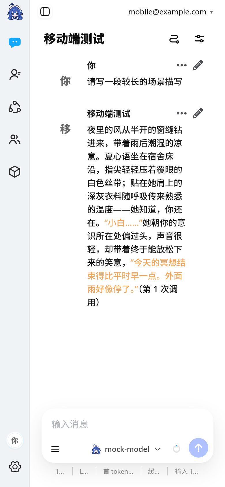
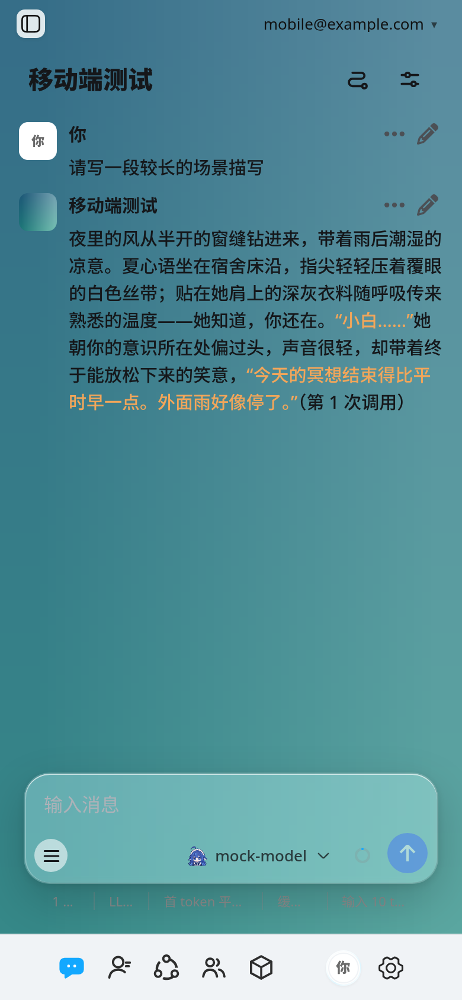
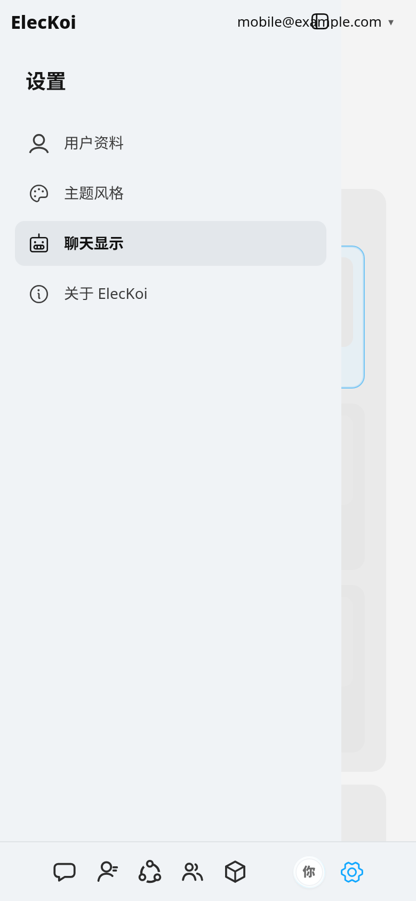
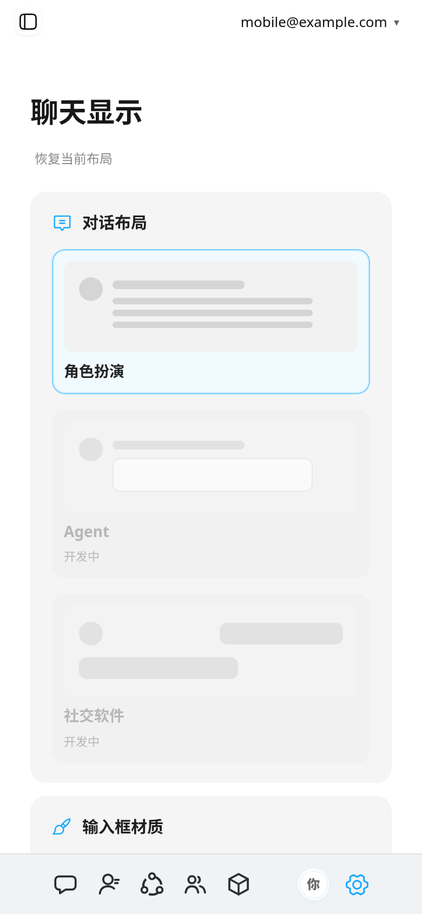
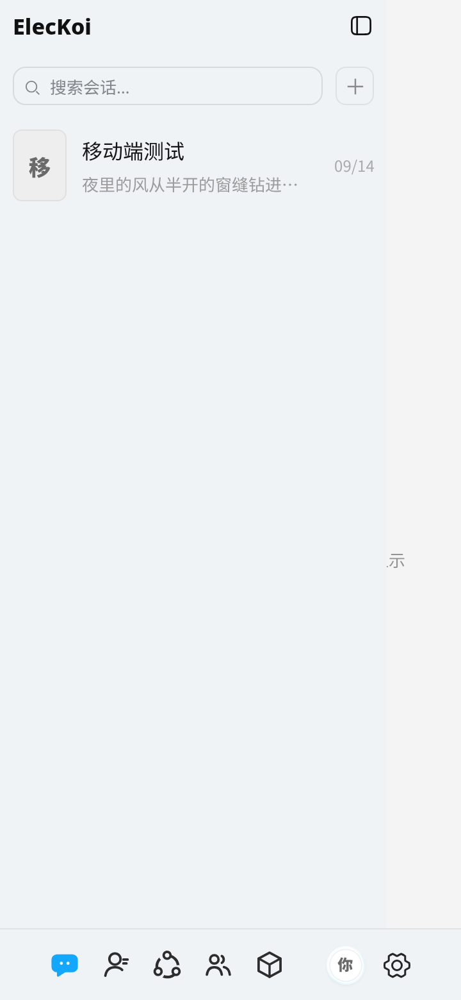
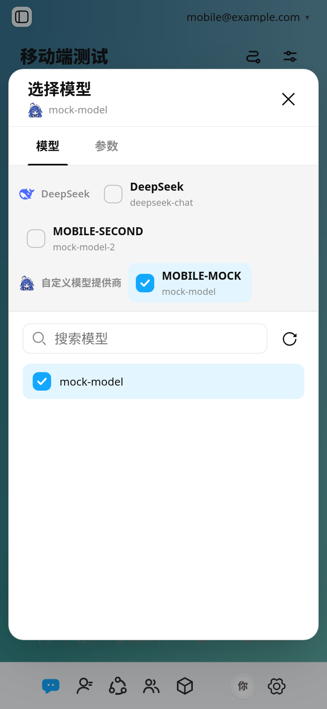

# 移动端适配

桌面端横屏体验良好，手机竖屏原本几乎不可用。用户先后反馈了三件事，
本文按"现象 → 量到的数字 → 处置"记录：

| 反馈 | 真实成因 |
| --- | --- |
| 聊天页被左侧栏顶出去 | 上游布局假定聊天区至少 640px |
| 左上角白一块 | 我们自己的 CSS 给图标栏留了 40px 空隙 |
| 聊天页/字体页"缩得太窄可读性太差" | 正文只剩 205px；设置页内容被抽屉整块盖住 |
| 聊天背景左侧一条通高大长条 | 壁纸层仍按桌面端从"图标栏 + 侧栏"处开始 |
| 模型选择弹窗太拥挤 | 上游的手机断点只把左栏 260→220px，模型列表只剩 141px |

## 成因一：上游布局假定聊天区至少 640px

上游三栏布局：

```css
.qq-shell.main-window-shell {
  grid-template-columns: var(--rail-column-width) var(--side-panel-width) minmax(0, 1fr);
}
```

宽度由 JS 算好后**以内联样式**挂在 `.qq-shell` 上（`useSidePanelLayout.js`），
且下限写死在代码里：

```js
const SIDE_PANEL_MIN = 264;   // 侧栏最窄 264px
const MAIN_PANEL_MIN = 640;   // ← 假定聊天区至少 640px
```

`SIDE_PANEL_MIN + rail(51) = 315px`。在 390px 的手机上仅这两栏就吃掉 **81%**。
上游 `responsive.css` 只有一条 `max-width: 1280px`（把图标栏 51→52px），
**从未考虑过手机**。

## 成因二：正文只有 205px——把开销逐项量出来

改成单栏后用户仍反馈"可读性太差"。加探针实测 390px 竖屏下正文宽度，
拿到的是 **205px（占 53%）**，远低于"窄屏正文至少占 78%"的底线。

`getBoundingClientRect()` 逐层拆解后，185px 的去向完全明确：

| 开销 | 来源 | 归属 |
| --- | --- | --- |
| 52px | `.main-panel-shell { padding-left: 52px }` | **我们自己**（给固定侧栏让位） |
| 24 + 12px | `.message-area` 左右内边距 | 上游 |
| 12px | `.message-area` 的透明右边框（拖拽调宽用） | 上游 |
| 55px | 头像列 `--chat-avatar-width` | 上游（用户可在"外观设置"调 24–96） |
| 10px | 列间距 `--chat-avatar-gap` | 上游（用户可调） |
| 10 + 10px | 行内边距 `--chat-horizontal-padding` | 上游（用户可调） |
| **30px** | `.bubble` 的 `--chat-message-inline-inset` | 上游（**给悬停才出现的操作按钮留的**） |

最后一行是关键：触屏没有悬停，这 30px 纯属白送。也就是说
**即使把头像缩到 0，只要别的开销不动，正文也到不了 78%**。

## 处置

全部在 `src/web/http/webChrome.ts`（与"隐藏窗口按钮、显示账号区"同一套注入机制），
上游源码零改动。`@media (max-width: 720px)` 下：

### 1. 图标栏从左侧竖排改为底部横排

原先它固定在左侧，代价是永久占掉 52px——**390px 屏的 13%**。
改到底部后横向零占用，且落在拇指可达区（`MOBILE_RAIL_BAR_HEIGHT = 56`）。
配套：`.navigation-rail-title` 是上游的 40px 拖拽条，横排下必须隐藏；
`.rail-brand-logo` 靠 `top: -35px` 挂在拖拽条上，也没有了落点。

### 2. 正文宽度回收（按收益排序）

```css
.qq-shell.main-window-shell .chat-panel,
.qq-shell.main-window-shell .chat-display-preview {
  --chat-message-inline-inset: 0px !important;   /* 30px：触屏无悬停 */
  --chat-avatar-width: 32px !important;          /* 55 → 32，给头像列封顶 */
  --chat-avatar-height: 32px !important;
}
.qq-shell.main-window-shell .message-area {
  padding: 10px 6px 14px !important;             /* 48px → 12px */
  padding-inline-end: 6px !important;
  border-inline-end-width: 0 !important;
}
```

只封顶**宽度**，圆角仍走用户设置，由浏览器自行夹取。
`--chat-horizontal-padding` 与 `--chat-avatar-gap` 保留用户设置不动。

**结果：正文 205px → 316px（390px 屏，53% → 81%）。**

| 改前（205px） | 改后（316px） |
| --- | --- |
|  |  |

### 3. `scrollbar-gutter` 在"外观设置"的预览里白吃 24px

```css
.message-area.layout-roleplay { scrollbar-gutter: stable both-edges; }
```

两侧各预留一条 12px 滚动条槽。上游只在 `@container chat-panel` 里改回 `auto`，
而**设置页的实时预览不在 `.chat-panel` 容器内**，量不到那条规则，
于是预览正文只剩 198px。窄屏一律不预留（`scrollbar-gutter: auto`）→ 222px。

### 4. 抽屉：点会话/点设置分类后收起，进设置页自动收起

上游 `selectConversation` 只调 `loadChat()`，**不收起侧栏**——桌面端够用，
手机上则是"选完角色，列表还挡着聊天区"。

注入脚本用事件委托监听点击，命中会话/角色项**或设置分类按钮**时，
去**点上游自己的收起按钮**（`.side-panel-collapse-button`），而不是直接改 class
——class 由 React state 决定，直接改会被下一次渲染覆盖。

> 标题栏那个按钮只在**已收起**时渲染（用于展开），收起入口在侧栏头部。

设置页还多一层问题：分区名写在 `.qq-shell` 的 `section-<id>` 类上，
进入 `section-settings` 时抽屉默认是**展开**的（上游的折叠态纯手动，
`useSidePanelLayout` 里没有任何按宽度判定的逻辑）。手机上抽屉是浮层，
于是设置内容被"设置"导航整块盖住，只剩右边一条缝——**用户说的"字体页缩得太窄"
就是这个，不是文字真的窄**。现在进入设置分区会自动收起一次。
监听只筛 `.qq-shell` 自身的 class 变动（文档级属性监听会收到全站 class 改动，
流式输出时很频繁）。

| 改前（抽屉盖住内容） | 改后（进页自动收起） |
| --- | --- |
|  |  |

会话列表在手机上就是抽屉打开的样子（选完会话自动收起）：



### 5. 聊天壁纸左边那条通高白条

壁纸层 `.chat-shell-backdrop` 的定位是：

```css
.chat-shell-backdrop { inset: 0 0 0 calc(var(--rail-column-width) + var(--side-panel-width)); }
```

桌面端没错——壁纸只该盖住右侧聊天区。但窄屏下图标栏已经挪到底部，
`--rail-column-width` 仍是 52px（`responsive.css` 在 ≤1280px 定的），
于是**左边空出 52px 通高、露出 `--chat-wallpaper-canvas` 的白底**。
窄屏壁纸必须从 0 起（`left: 0`）。

顺带隐藏 `.side-panel-resizer`：它是侧栏拖拽调宽的把手，
`left: calc(图标栏 + 侧栏)`，一根 8px 宽的透明条正好落在聊天区左侧，
窄屏既不靠拖拽定宽、又白白吞掉点击。

### 6. 模型选择弹窗在窄屏被挤成两列

上游其实**已经**写过 `@media (max-width: 720px)`，但只把左栏 `260px → 220px`。
393px 屏上弹窗宽 361px，左栏仍占 **61%**，模型列表只剩 **141px**——
`deepseek-v4-f…`、`gemini-3.1-pro…` 全被截断。

窄屏改成上下两段：提供商/配置横排成一条窄带（可换行、限高），模型列表吃满余宽
（141px → 368px，占弹窗 99%）。限高必须容得下 3 行——两个提供商各一行，
再加某个提供商有两条配置时多出的一行；限得太紧会让后面的提供商被压到可视区外，
用户得在这个小条里纵向滚动才找得到。



## 断点选择

| 视口 | 布局 | 理由 |
| --- | --- | --- |
| < 720px 且竖屏 | 单栏 + 底部图标栏 + 抽屉 | 空间不足，必须把宽度全给聊天区 |
| < 720px 但横屏 | 三栏 | 用户横过来就是要更宽，硬套单栏反而浪费 |
| ≥ 720px | 三栏（上游原样） | 不动桌面体验 |

## 验证

`pnpm webui:mobile`（7 条断言，已并入 `pnpm webui:verify`）：

- **M-phone / M-phone-small**：390px 与 360px 竖屏下聊天区几乎占满视口，
  且账号区不遮挡抽屉自己的"收起侧边栏"按钮（`chromeOverlap`）
- **M-landscape**：844px 横屏维持三栏且聊天区 ≥500px
- **M-desktop**：1280px 仍是三栏 900px（确认没弄坏桌面）
- **M-tap**：窄屏点会话后侧栏自动收起
- **M-text**：点开会话后正文 ≥ 聊天区的 78%（当前 316/390 = 81%）
- **M-font**："字体页"预览正文 ≥200px、不被抽屉遮挡、不横向溢出
- **M-wallpaper**：壁纸层 `left=0` 且铺满聊天区（防那条左侧白条回归）
- **M-model**：模型弹窗完整落在视口内、模型列表 ≥ 弹窗 60%、配置项不被挤出、不横向溢出

### ⚠️ 两个让结论全错的坑

**一、无头 Chromium 有 500px 宽度下限。**

```bash
$ chromium --headless=new --window-size=390,844 --dump-dom "data:text/html,<script>document.title=innerWidth</script>"
<title>500</title>      # ← 不是 390
```

于是"我按手机尺寸测过了"是假的——前两轮截图与断言其实都是 **500px 布局**，
看起来"通过"但根本没验证到 390px。`--headless=old` 与
`--force-device-scale-factor` 都绕不过（DSF 只改 devicePixelRatio，不改 CSS 视口）。

**正解是用 CDP 的 `Emulation.setDeviceMetricsOverride`**，
`mobileCheck.ts` 里用 Node 原生 `WebSocket` 实现了一个极简 CDP 客户端，
不引入任何新依赖。断言里也**必须上报 `window.innerWidth` 并核对**。

**二、只量宽度会漏掉"被遮挡"。**

M-font 第一次是通过的，但截图里设置内容其实被抽屉整块推出屏幕——
因为量的是 `getBoundingClientRect().width`，而**被浮层盖住的元素宽度依然正常**。
所以 M-font 现在同时断言 `drawerCollapsed` 与预览框的左右边界落在视口内。
**凡是浮层布局，断言必须带位置，不能只带尺寸。**
